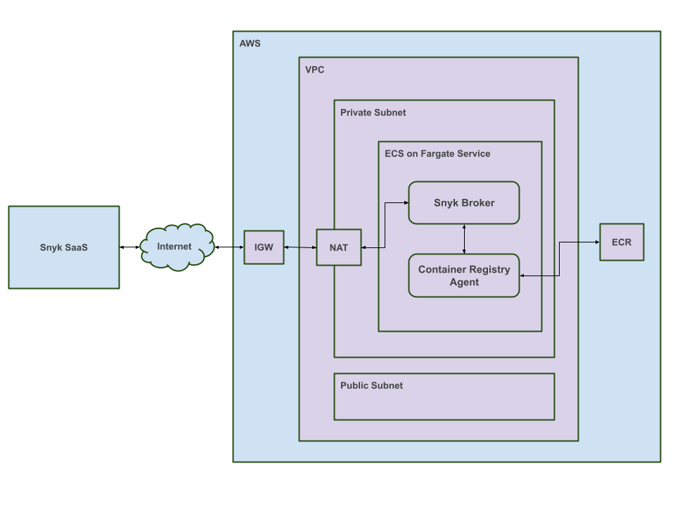
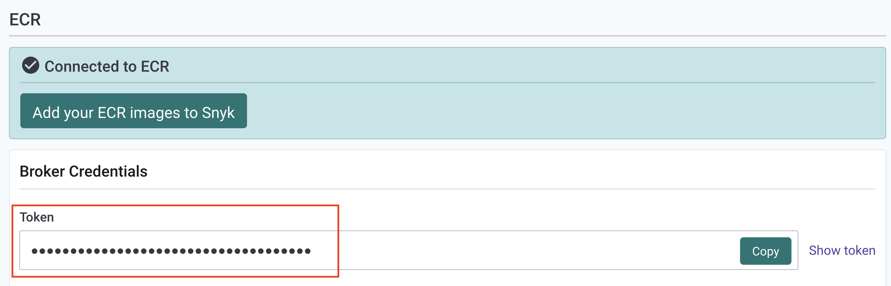
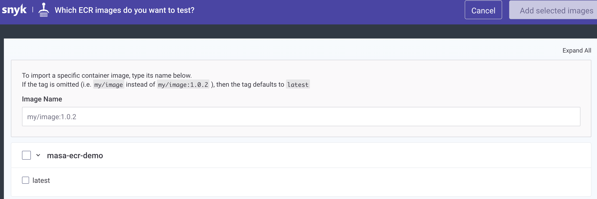

# Snyk Broker Private ECR demo

## What's this demo?

This demo sets up demo environment for AWS private ECR.
Setting up this demo is provisioned by Terraform.
In terraform, 
* Create VPC (along with IGW, NAT, Subnets, etc)
* Create ECR 
* Create sample container image using Docker
* Push the docker image to ECR
* Create ECS cluster
* Run Snyk broker container on Fargate in private subnet
* Run Snyk Container Registry Agent on Fargate in private subnet

This demo automates all steps written in [Snyk documentation](https://docs.snyk.io/features/snyk-broker/snyk-broker-container-registry-agent/setting-up-the-container-registry-agent-for-a-brokered-ecr-integration).

When terraform successfully provisions, you should have AWS infra as below.



**Note:** This demo only works in your local machine. Meaning, this demo won't work on Terraform cloud. This is because docker build occurs during the provisioning and it only works from local machine, not on Terraform cloud SaaS. 

## Prerequisite

*  Terraform 
    ``` shell
    brew tap hashicorp/tap
    brew install hashicorp/tap/terraform
    ```
    Reference: [Install Terraform](https://learn.hashicorp.com/tutorials/terraform/install-cli)
    
* Docker
  * [Get Docker](https://docs.docker.com/get-docker/)

* Snyk Broker Token for ECR
    * Go to Snyk UI -> ECR -> Broker credentials
        
* AWS credentials

## Steps

### Step0: Clone this repository

```
git clone https://github.com/masa-snyk/broker_private_ecr.git
```

or

```
git clone git@github.com:masa-snyk/broker_private_ecr.git
```

### Step1: Set AWS credentials in your enviroment variables

In your teminal
```
export AWS_ACCESS_KEY_ID=<access key>
export AWS_SECRET_ACCESS_KEY=<secret_key>
export AWS_DEFAULT_REGION=<aws region>
```

If your credentail is generated by STS or Assumed role, you alse need to set following:
```
export AWS_SESSION_TOKEN=<security_token>
```

**Note:** *Never write your credentials in terraform config or use it as terraform variables. It will show up in your terraform state file, which might accicentally pushed to public repos.*

### step 2: Modify Terraform variable

Rename `terraform.tfvars.example` to `terraform.tfvars`.

```
mv terraform.tfvars.example terraform.tfvars
```

Modify the contents

```
prefix       = "<replace this with your name>"
broker_token = "<replace this with your broker token>"
```

* `prefix` -> Your name or whatever
    * `prefix` is prepended to all of your resources, so it won't conflict with others in same AWS region.
* `broker_token`
  * Broker token obtained from Snyk UI

### Step 3: Run terraform

```
terraform init
terraform plan
```

If not error, do actual provisioning.

```
terraform apply --auto-approve
```

### Confirm the integration works

Now you should have your infrastructure on AWS with ECR, ECS, Broker, agent all set up.

If you go to Snyk's integration page, you should now see the your private private ECR Repo.



Now ECR, broker, CRA are all set up.  
Push your favorite container images, and start scanning!
https://docs.aws.amazon.com/AmazonECR/latest/userguide/docker-push-ecr-image.html

## When you are done working on it

**Don't forget to destroy all of your infrastructure.**
If you leave it, it will cost you (like running water all the time).

```
terraform destroy -auto-approve
```

## Debug

If you want to log in to broker or cra (container registry agent) containers for debug purpose, do following:

**Note:** You need AWS CLI and Session manager plugin installed in your local machine.
  * AWS CLI
    * https://docs.aws.amazon.com/cli/latest/userguide/getting-started-install.html

  * Session manager plugin
    * https://docs.aws.amazon.com/systems-manager/latest/userguide/session-manager-working-with-install-plugin.html#install-plugin-macos

 ### To login in to a Broker container

```
./debug/debug_login_into_broker.sh broker
```

### To login in to a CRA container

```
./debug/debug_login_into_broker.sh cra
```

## Action Items

* [ ] Using ECS on EC2 version?
* [ ] Terraform cloud compatible versioin?
